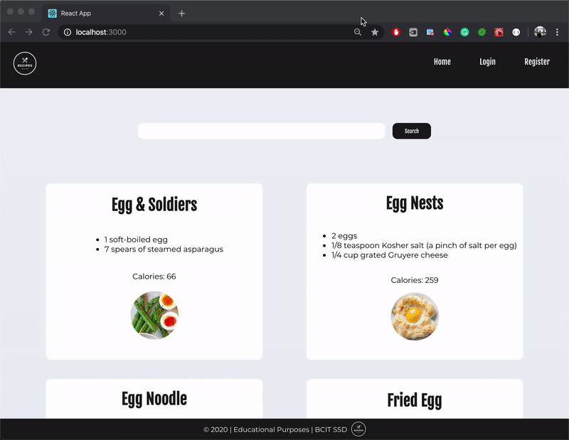
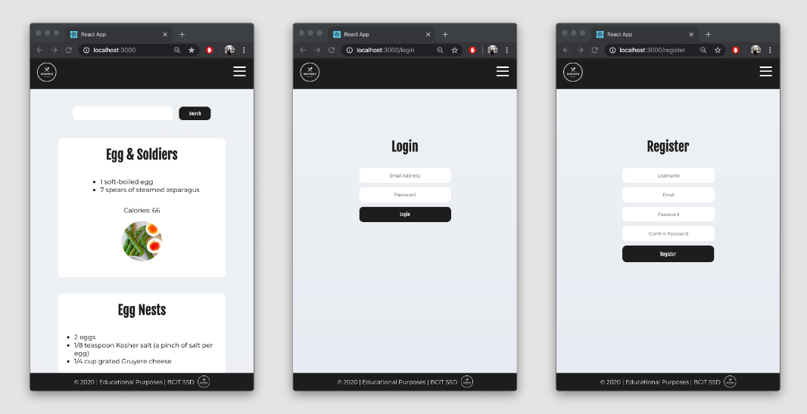
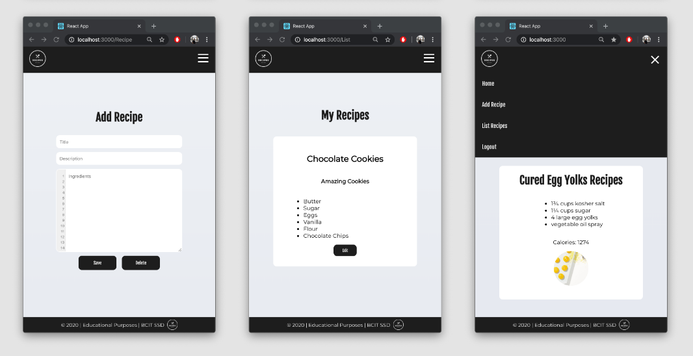

# Recipes - SSD
A React and .NET Recipe Web App created by Anna, Sara, Eric, Albert. Copyright 2020.

## Features
- Search for recipe ideas from the Edamam API
- Users have the option to register and login
- Once logged in, create and save recipes to your account
- View, edit, and delete personal recipes

## Technologies
- React 
- .NET Core
- Edamam API

## Application Images

